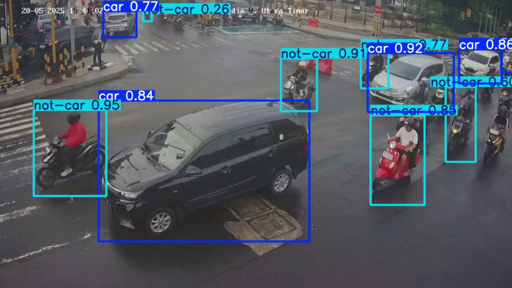
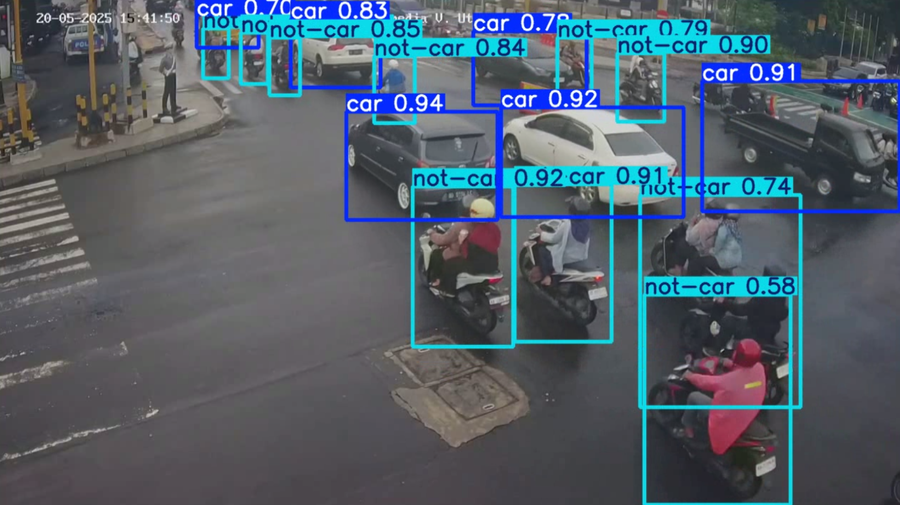
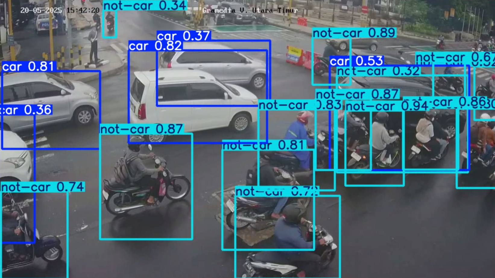
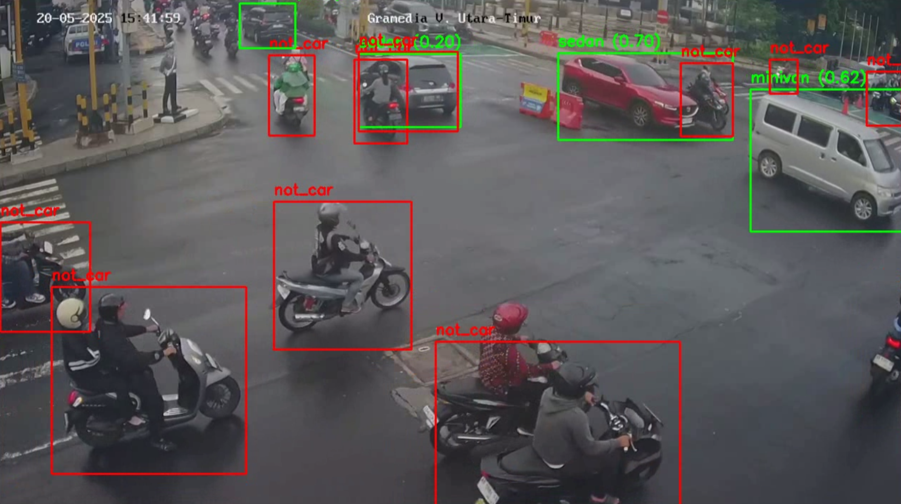
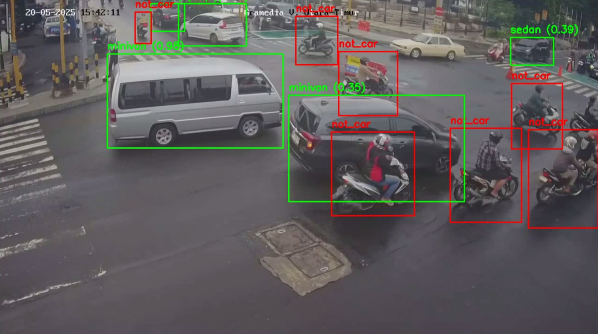
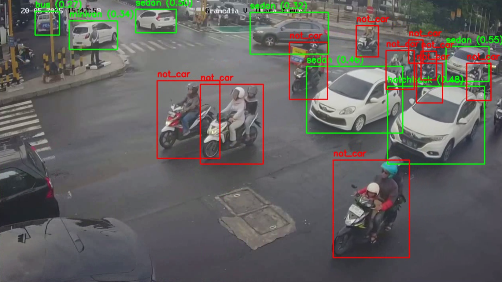

# 🚗 Indonesian Car Detection and Classification System

This repository contains the complete pipeline for detecting and classifying cars in images using YOLOv5 for object detection and a custom CNN classifier for car type recognition. The system is specifically trained on an Indonesian car dataset and is built for real-world deployment and explainability.

## 📌 Project Overview

This project aims to build a robust computer vision system capable of:

- **Detecting** vehicles in images using the YOLOv5 object detection model.
- **Classifying** detected vehicles into predefined Indonesian car types using VGG16 classifier.

## 🌟 Objectives

- Create a highly accurate object detection model for cars in Indonesian context.
- Train a fine-grained classifier to distinguish multiple local car models/types.
- Develop a modular pipeline for training, evaluation, and inference.
- Ensure explainability and future scalability of the system.

## 🏠 Project Structure

```
.
├── activity_log/                               # store download, training, evaluation, and test log files
├── classification/                             # folder related to car type classifier
│   ├── model/                                  # vgg model artifact
│   ├── data/                                   # data for model classification
│   │   ├── crop/                               # cropped data from raw
│   │   ├── preprocess_data/                    # classifier preprocessed data
│   │   │   ├── augmented_train/                # classifier train data which has been augmented (consist of 11 classes)
│   │   │   ├── test/                           # classifier test data (consist of 11 classes)
│   │   │   ├── train/                          # classifier train data (consist of 11 classes)
│   │   │   └── val/                            # classifier validation data (consist of 11 classes)
│   │   └── raw/                                # data from crawling result (consist of 11 classes)
│   └── src/                                    # support script for model classifier
├── detection/                                  # yOLOv5-based detection module
│   ├── model/                                  # custom YOLOv5 training scripts and config
│   │   ├── artifact/                           # best weight of yolov5s model for car detection
│   │   └── yolov5/                             # yoloV5 model repository
│   ├── data/                                   # dataset YAML and image annotations
│   │   └── Deteksi-Kendaraan-Indonesia-3-2/    # dataset for car detection model taken from roboflow
│   ├── images/                                 # images related to car detection training results
│   ├── result/                                 # result of car detection model
│   │   ├── images/                             # images related to car detection results
│   │   └── video/                              # video related to car detection results
├── notebooks/                                  # jupyter notebooks for models experiments
├── presentation/                               # presentation files regarding this projects
├── result/                                     # result of the car detection and classification
│   ├── images/                                 # images related to car detection and classification
│   └── video/                                  # video related to car detection and classification
├── utils                                       # helper script
├── requirements.txt                            # project requirements
└── README.md                                   # project documentation
```

## 🧠 Models Used

### 1. **Object Detection**

- **Model**: YOLOv5s
- **Training Data**: Annotated dataset using Roboflow
- **Metrics**: mAP, Precision, Recall, F1 Score

### 2. **Classification**

- **Model**: VGG16
- **Labels**: Indonesian car types (e.g., Bajaj, Truck, SUV, etc.)
- **Loss Function**: Cross Entropy Loss
- **Metrics**: Accuracy

## 📊 Evaluation Results

### 🔍 Detection (YOLOv5)

- **Precision**: *e.g., 0.87*
- **Recall**: *e.g., 0.85*
- **mAP\@0.5**: *e.g., 0.88*

### 🧪 Classification (CNN)

- **Accuracy**: *e.g., 82%*
- **Confusion Matrix**: ✅ Well-separated classes
- **PR Curve / ROC Curve**: ✅ Threshold tuning done for optimal F1

## 📦 Installation

```bash
git clone https://github.com/stefanus-yudi-irwan/car-detection-and-classification.git
cd car-detection-classification
pip install -r requirements.txt
```

It is better to also install:
- CUDA & cuDNN (for GPU support)

## 🏃 How to Run

This project can be examined by solely using this file `notebooks/car-detection-and-classification.ipynb` all the projects logic and documentations can be found there.

Or you can go to this [kaggle notebook](https://www.kaggle.com/code/stefanusyudiirwan/car-detection-and-classification) of mine and use the free GPU T4 there to run this projects.

## 🖼️ Example Results

The result of car detection

<p align="center">
  
  
  
</p>

The result of car detection and classification

<p align="center">
  
  
  
</p>

## Creator
👨‍💼 Maintained by **Stefanus Yudi Irwan**\
📧 Reach out: [My Websites](https://stefanus-yudi-irwan.github.io/)